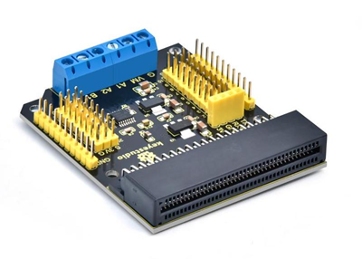
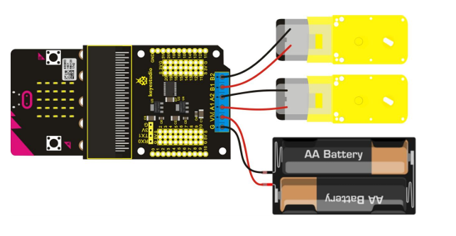
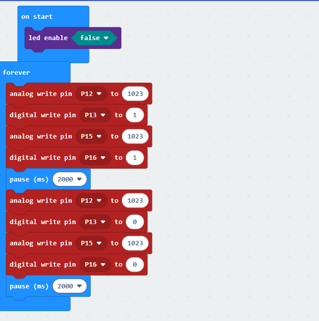

# Keyestudio Micro:bi Motor Driver Expansion Board

## 1.Download the test code

download:[code](./code.7z)

## 2. Description

Micro ： bit , a microcontroller of ARM structure designed by BBC, is designed for those who love to learn programming. It supports the PXT graphical programming interface developed by Microsoft. You don’t need to download additional compilers. It can be used under Windows, macOS, IOS, Android and other systems.

To take advantage of the driver DC motor, we designed this expansion board. The board integrates 3.3V and 5V voltage regulator chips, serial communication interface for connecting BT modules and a DRV8833CPWP chip which outputs the maximum 700mA currentIt also has four motor control modes: clockwise rotation/anticlockwise rotation/boot/stop. PWM  supports frequencies up to 100 kHz.

This board also has 3-pin interfaces which can be connected to other sensors.

The motor pin A1, A2, B2 and B1 ofthe expansion board are controlled by P13, P12, P15 and P16 of the micro:bit board.

## 3. Specification

VMinput voltage: DC 5-10.8V 

Operating current of driving part: ≤700mA 

Motor output configuration: double h-bridge 

Working temperature: 0~50 

Size: 70mm*58mm

##  4.Connection Diagram

## 5. Test Code

## 6. Test Result

Wire up, upload the code and power on. Two motors rotate clockwise for 3s and anticlockwise for 3s.

